## Step 1: Deploy Core Network

**Option A (Terminal):**
Click on the **Terminal button** to open the terminal then from the project root directory, execute the following command:

### Deploy Core Network Components

This command launches all the essential core network components (like AMF, SMF, UPF, NRF, and more) in the background. The `-d` flag means "detached mode" — the containers run in the background without cluttering your terminal output. Think of it as starting up the entire 5G network infrastructure that everything else will connect to.

```bash
docker compose -f docker-compose.yml up -d
```

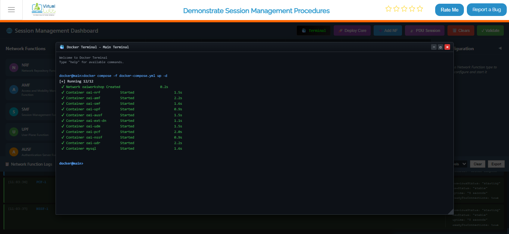

*Fig: Terminal output showing core network deployment with docker compose*

### Deploy gNB (Base Station) Services

Once your core network is up and running, it's time to deploy the gNB (Base Station). This command spins up the gNB containers and establishes the connection between the gNB and your core network, so they can start communicating with each other.

```bash
 docker compose -f docker-compose-gnb.yml up -d
 ```

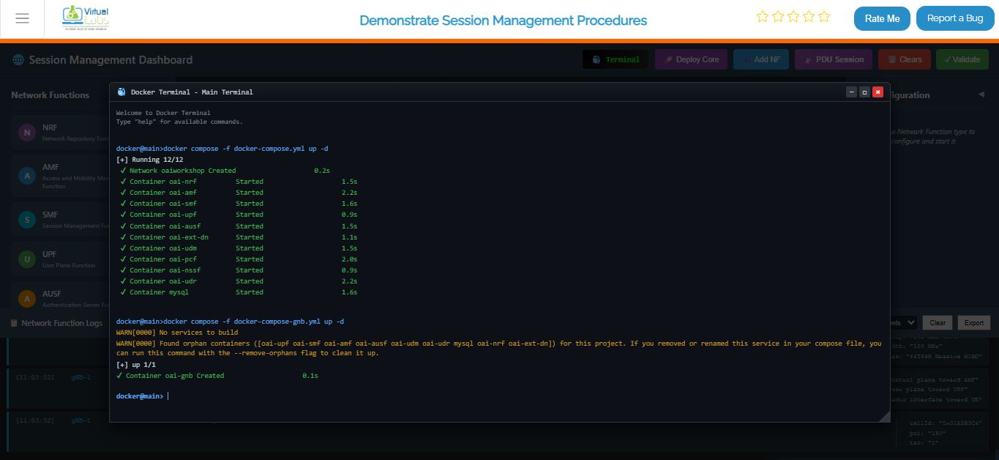

*Fig: Terminal output showing gNB deployment and connection to core network*

### Deploy UE (User Equipment) Services

Now it's time to bring the end users into the network! This command starts up the UE (User Equipment) containers and connects them to the gNB. The UEs are essentially the "phones" or "devices" in your 5G network simulation.

```bash
docker compose -f docker-compose-ue.yml up -d
```

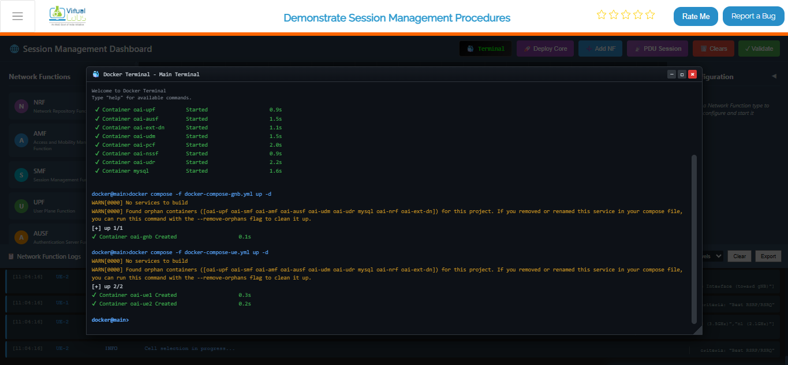

*Fig: Terminal output showing UE deployment and attachment to gNB*

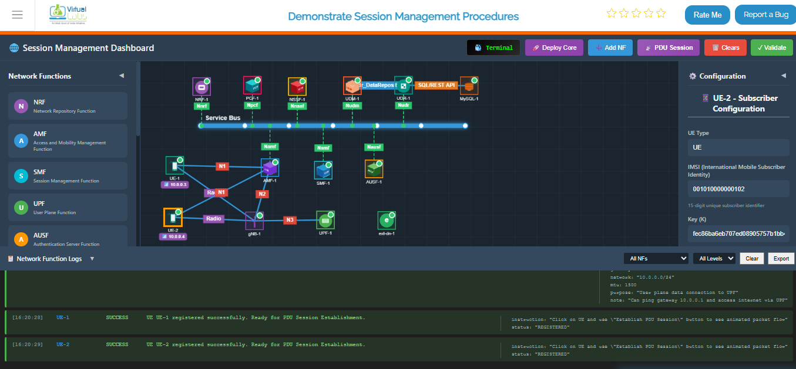

*Fig: Complete 5G network topology with UE, gNB, and all core network functions running*


### View All Running Containers

Want to see what's actually running? This command shows you a complete list of all containers that Docker is currently running — including their IDs, status, and names. It's your way of checking "is everything up and running?"

```bash
docker ps
```
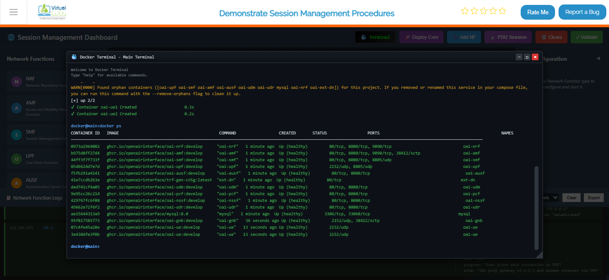

*Fig: Docker PS output listing all running 5G network containers with their status*

### Live Monitoring Dashboard for Core Network

This is like setting up a live dashboard that refreshes every 2 seconds, showing you the real-time status of all your core network containers. It's perfect for keeping an eye on things while everything is running — you can see if any containers crash or their status changes without needing to run the command over and over.

```bash
watch docker compose -f docker-compose.yml ps -a
```
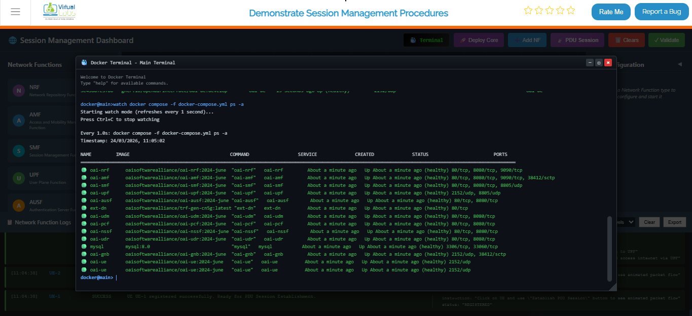

*Fig: Continuous real-time monitoring of core network container status*

**Option B (Automatic):** Click the Deploy Core button on the top toolbar. This will automatically clear any existing topology and sequentially deploy the Service Buses, Network Functions (NRF, AMF, SMF, UPF, UDR, PCF, gNB, UE), and establish the necessary connections.

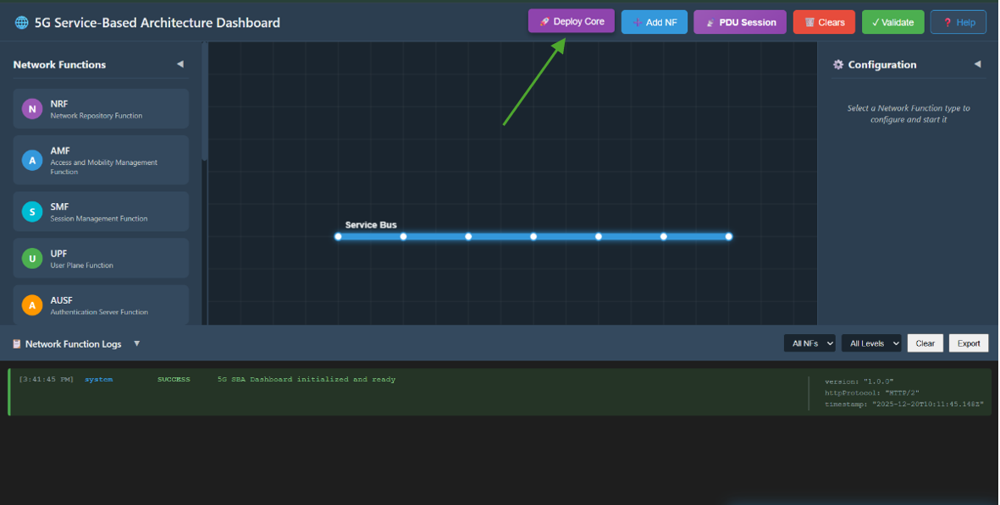

*Fig: Core Network Deployment*


**Option C (Manual):** Manually add each Network Function from Network function panel then enter configuration detail in the left configuration panel and start NF.


---

## Step 2: Enable PDU Session Mode

Once the core network is successfully deployed and all NFs show a "Stable" status, click on the PDU Session button in the top toolbar to switch the interface to the Session Management experiment mode.

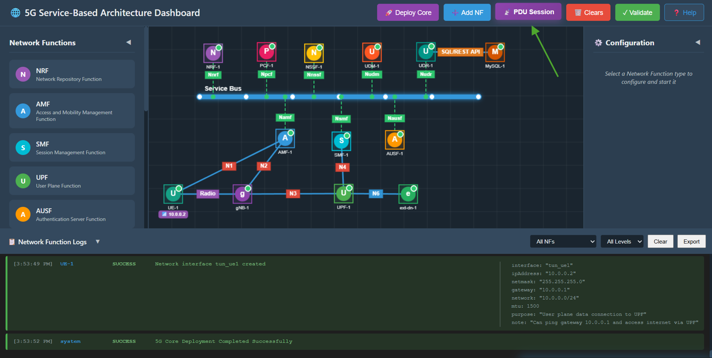

*Fig: PDU Session Mode*

---

## Step 3: Observe Experiment Panels

You will now see:

- **Right Panel (PDU Session Establishment):** A step-by-step interactive flow for the PDU session creation process.
- **Left Panel (PDU Session Messages):** An inspector panel that displays the JSON content of every Request and Response message sent between NFs.

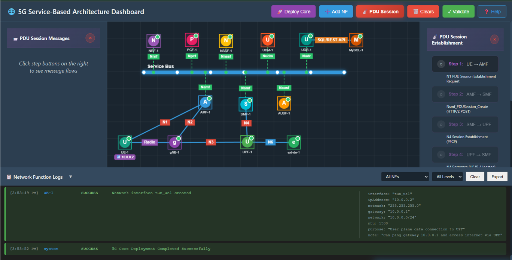

*Fig: Experiment Panels*

---

## Step 4: UE Requests Session

Click Step 1 in the right panel.

- **Action:** UE sends a PDU Session Establishment Request to the AMF via N1 interface.
- **Observation:** A packet travels from UE to AMF. The left panel shows the NAS message details including supi, dnn, and requestType.

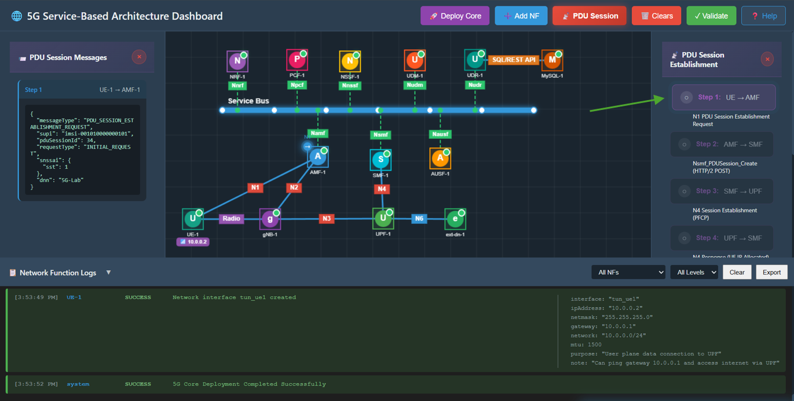

*Fig: UE Session Request*

---

## Step 5: AMF Selects SMF

Click Step 2 in the right panel.

- **Action:** AMF forwards the request to the SMF by sending Nsmf_PDUSession_Create.
- **Observation:** A packet travels from AMF to SMF. The left panel verifies that AMF has selected an SMF.

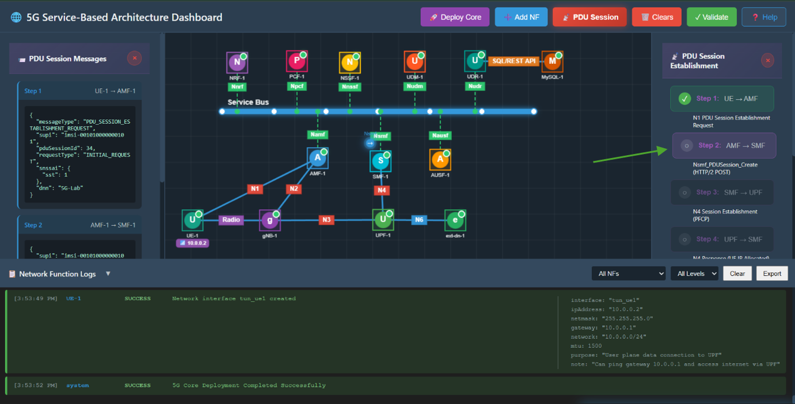

*Fig: AMF Selects SMF*

---

## Step 6: SMF Configures UPF

Click Step 3 in the right panel.

- **Action:** SMF instructs the UPF to establish a user plane session via N4 Session Establishment Request.
- **Observation:** A packet travels from SMF to UPF. This requests resource allocation on the User Plane.

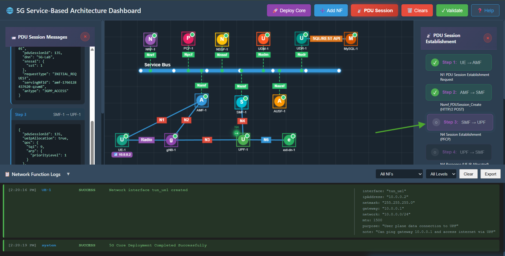

*Fig: SMF Configures UPF*

---

## Step 7: UPF Allocates IP

Click Step 4 in the right panel.

- **Action:** UPF processes the request, allocates an IP address for the UE, and sends an N4 Session Establishment Response back to the SMF.
- **Observation:** A packet travels from UPF to SMF. The response JSON contains the assigned ueIp and tunnelId.

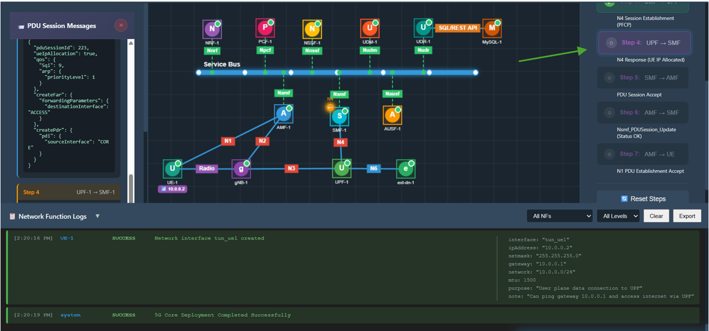

*Fig: UPF Allocates IP*

---

## Step 8: SMF Accepts Session

Click Step 5 in the right panel.

- **Action:** SMF sends a Nsmf_PDUSession_Create Response back to the AMF, confirming the session is ready.
- **Observation:** A packet travels from SMF to AMF. The message includes QoS rules and the allocated IP address.

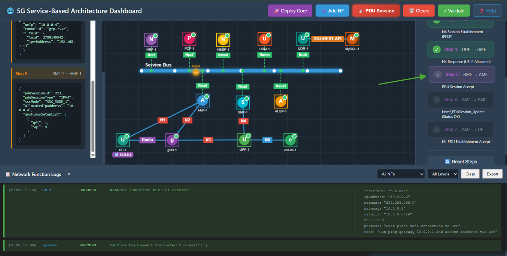

*Fig: SMF Accepts Session*

---

## Step 9: AMF Updates SMF

Click Step 6 in the right panel.

- **Action:** AMF sends a Nsmf_PDUSession_Update message to the SMF to confirm the status is active and resources are ready.
- **Observation:** A packet travels from AMF to SMF. The message confirms Status: Active.

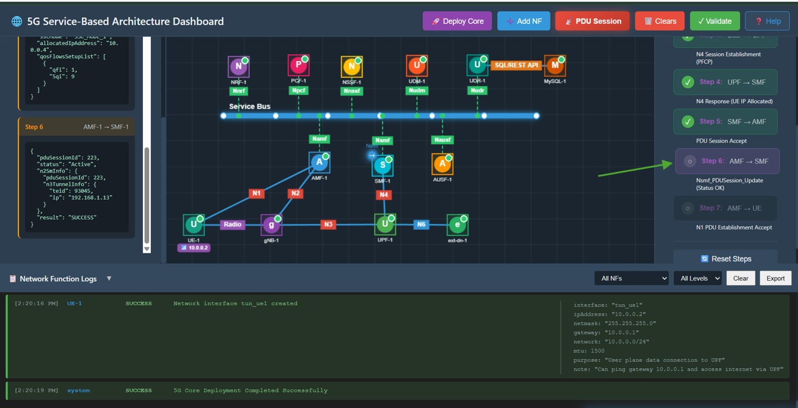

*Fig: AMF Updates SMF*

---

## Step 10: AMF Notifies UE

Click Step 7 in the right panel.

- **Action:** AMF sends the final PDU Session Establishment Accept message to the UE.
- **Observation:** A packet travels from AMF to UE. The UE receives its IP address (10.0.0.x) and the PDU Session is marked as Established.

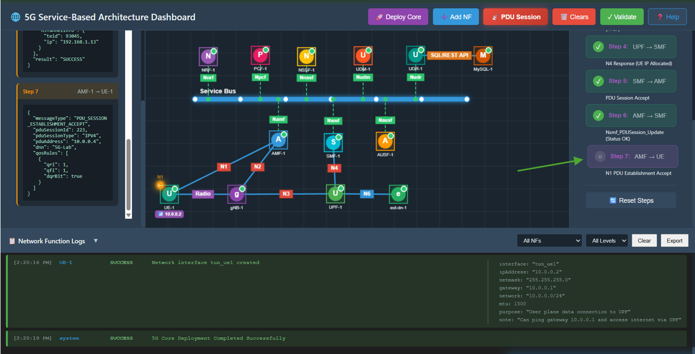

*Fig: AMF Notifies UE*