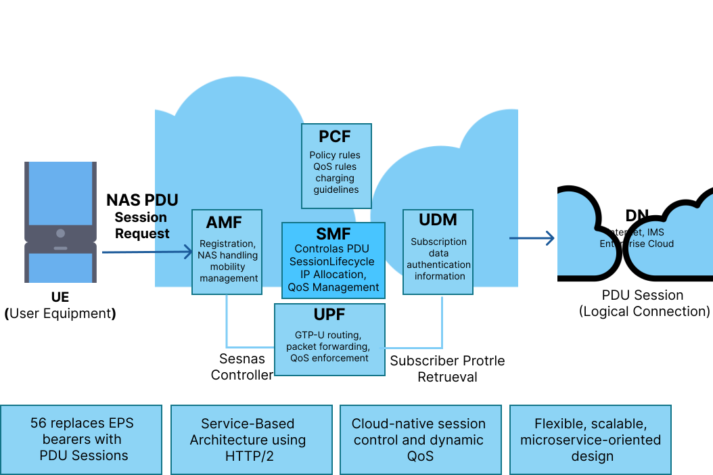
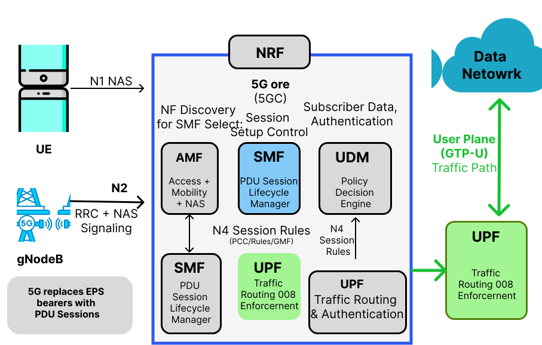
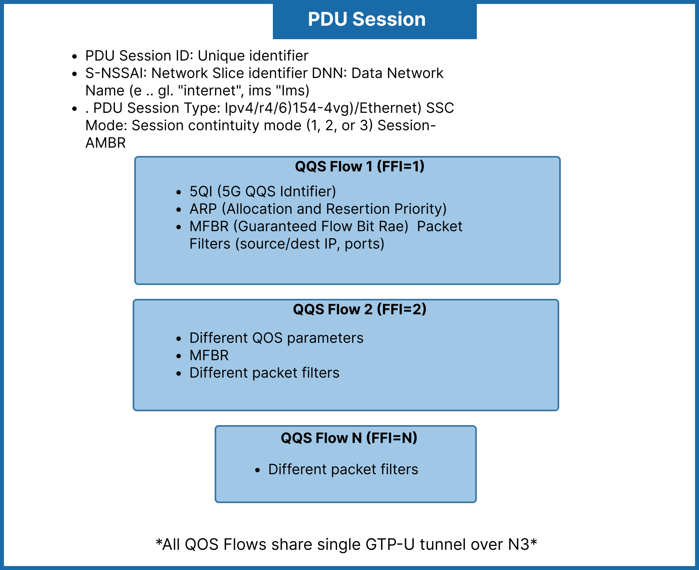
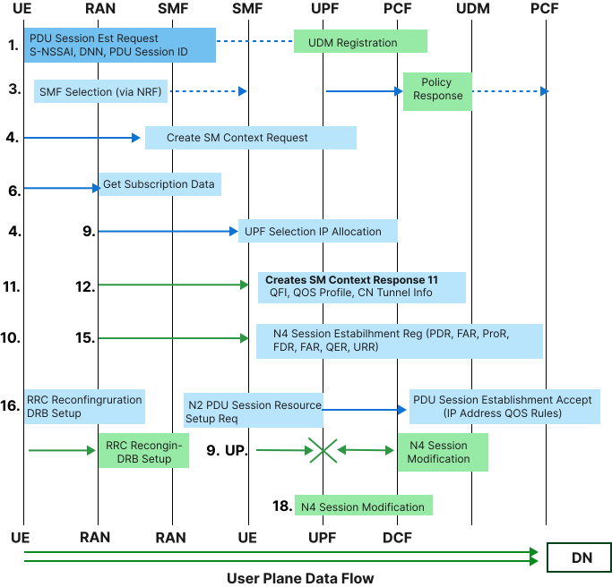
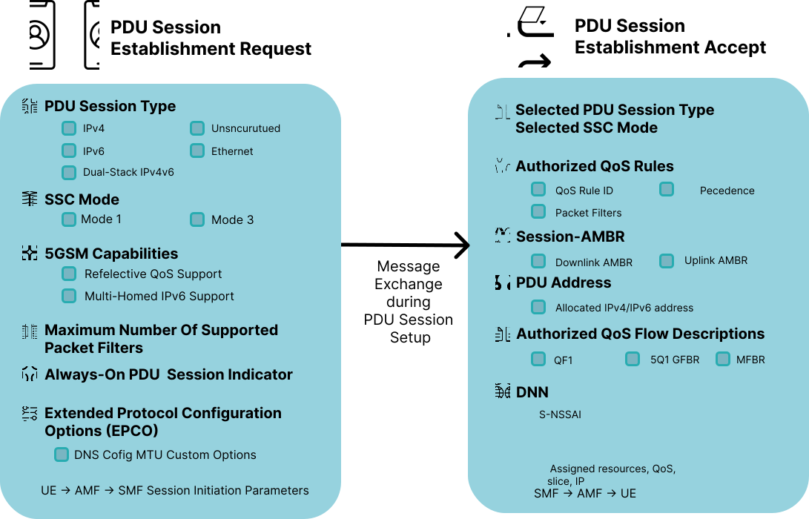

## 1.  5G Session Management

### 1.1 Introduction to Session Management in 5G

Session Management is a core functionality of the 5G Core (5GC) network that enables communication between the User Equipment (UE) and external Data Networks (DN) such as the internet, IMS, or enterprise services.

Unlike 4G LTE, where connectivity is managed through EPS bearers, 5G introduces a more flexible and scalable concept known as the **PDU (Protocol Data Unit) Session**. A PDU session represents a logical connection that allows the UE to send and receive data through the 5G network.

At the center of this architecture is the **Session Management Function (SMF)**, which acts as the control entity responsible for managing the entire lifecycle of a session.

### 1.2 Key Responsibilities of Session Management

- Establishing PDU sessions between UE and Data Network  
- Allocating IP addresses to the UE  
- Selecting appropriate User Plane Function (UPF)  
- Applying Quality of Service (QoS) policies  
- Managing session mobility and continuity  
- Handling session modification and release  

The 5G session management framework is built on the **Service-Based Architecture (SBA)**, where network functions communicate using **HTTP/2 REST APIs**, making the system highly scalable, modular, and cloud-native.

This design allows:

- Dynamic traffic routing  
- Low-latency communication  
- Efficient resource utilization  
- Seamless mobility support  

*Fig: Session management in 5G Core*

## 2. 5G Core Architecture for Session Management

Session management in 5G involves multiple network functions working together in a coordinated manner.

### 2.1 Network Functions and Their Roles

#### 2.1.1 AMF (Access and Mobility Management Function)

- Acts as the entry point for UE signaling  
- Receives PDU session requests from UE  
- Performs UE authentication and mobility tracking  
- Forwards session requests to SMF  

#### 2.1.2 SMF (Session Management Function)

- Central controller for session management  
- Establishes, modifies, and releases PDU sessions  
- Allocates IP addresses to UE  
- Selects appropriate UPF  
- Retrieves policy rules from PCF  
- Configures user-plane tunnels  

#### 2.1.3 UPF (User Plane Function)

- Handles actual data traffic  
- Routes packets between UE and Data Network  
- Performs QoS enforcement  
- Collects usage data for charging  

#### 2.1.4 PCF (Policy Control Function)

- Provides QoS policies  
- Defines charging rules  
- Controls traffic steering  

#### 2.1.5 UDM (Unified Data Management)

- Stores subscriber information  
- Provides allowed DNNs and slice data  
- Supplies authentication data  

#### 2.1.6 NRF (Network Repository Function)

- Helps in discovering available network functions  
- Assists AMF in selecting appropriate SMF  

*Fig: 5G Core Architecture for Session Management*

## 3. PDU Session Concepts

A **PDU Session** is a logical connection between the UE and a Data Network.

### 3.1 Key Parameters Explained

- **PDU Session ID**  
  A unique identifier assigned by the UE for each session.

- **S-NSSAI (Network Slice Identifier)**  
  Determines the network slice used for the session.

- **DNN (Data Network Name)**  
  Specifies the target network (e.g., internet, ims).

- **PDU Session Type**  
  Defines the protocol:
  - IPv4  
  - IPv6  
  - IPv4v6  
  - Ethernet  
  - Unstructured  

- **SSC Mode (Session Continuity Mode)**  
  Defines how the session behaves during mobility:
  - SSC Mode 1 → Always same UPF  
  - SSC Mode 2 → UPF can change  
  - SSC Mode 3 → Session may be released  

- **QoS Flows**  
  Each session can contain multiple QoS flows with different priorities.

*Fig: PDU Session Structure*

## 4. PDU Session Establishment Process

The PDU Session Establishment is a multi-step signaling procedure.

### 4.1 Step-by-Step Detailed Flow

Step 1. **UE → AMF**  
   UE sends **PDU Session Establishment Request** containing:
   - PDU Session ID  
   - S-NSSAI  
   - DNN  
   - Request type  

Step 2. **AMF Processing**

- Validates request  
- Checks subscription  
- Selects SMF via NRF  

Step 3. **AMF → SMF**

AMF sends **Create SM Context Request** including:

- SUPI  
- Session ID  
- Slice info  
- Location  

Step 4. **SMF → UDM**

- Retrieves subscription data  
- Gets allowed DNN and QoS  

Step 5. **SMF → PCF**

- Requests policy rules  
- Receives QoS and charging policies  

Step 6. **SMF Selects UPF**

- Based on location and load  
- Allocates IP address  

Step 7. **SMF → UPF (N4 PFCP)**

- Sends session rules:
  - PDR  
  - FAR  
  - QER  
  - URR  

Step 8. **UPF → SMF**

- Confirms session setup  

Step 9. **SMF → AMF**

- Sends session response  
- Includes QoS and tunnel info  

Step 10. **AMF → gNB**

- Sends N2 setup request  

Step 11. **gNB → UE**

- Establishes RRC and DRB  

Step 12. **UE Receives Accept**

- Gets IP address  
- Session becomes active  

Step 13. **User Plane Active**

Data flows:

UE → gNB → UPF → Data Network

*Fig: PDU Session Establishment Flow*

## 5. Session Management Messages

### 5.1 PDU Session Establishment Request

Contains:

- PDU type (IPv4/IPv6)  
- SSC mode  
- QoS capability  
- Request type  

### 5.2 PDU Session Establishment Accept

Contains:

- Assigned IP address  
- QoS rules  
- Session-AMBR  
- Selected slice  
- DNS configuration  

*Fig: Session Management Messages*

## 6. QoS Management in 5G

QoS in 5G is handled using **QoS Flows**.

### 6.1 Key Concepts

- **QFI (QoS Flow Identifier)**  
  Identifies each QoS flow  

- **5QI (5G QoS Identifier)**  
  Defines QoS characteristics such as:
  - Latency  
  - Priority  
  - Packet loss  

### 6.2 Reflective QoS

- UE derives QoS from downlink  
- Reduces signaling overhead  

### 6.3 Benefits

- Better traffic prioritization  
- Supports multiple services  
- Efficient bandwidth usage  

## 7. Session Modification and Release

### 7.1 Session Modification

Triggered when:

- QoS requirements change  
- New application demand  
- Policy update  
- Network optimization  

SMF updates:

- QoS rules  
- Traffic routing  
- Tunnel parameters  

### 7.2 Session Release

Triggered by:

- UE request  
- Network policy  
- Inactivity timeout  
- Radio failure  

After release:

- Resources are freed  
- Session context is removed  
