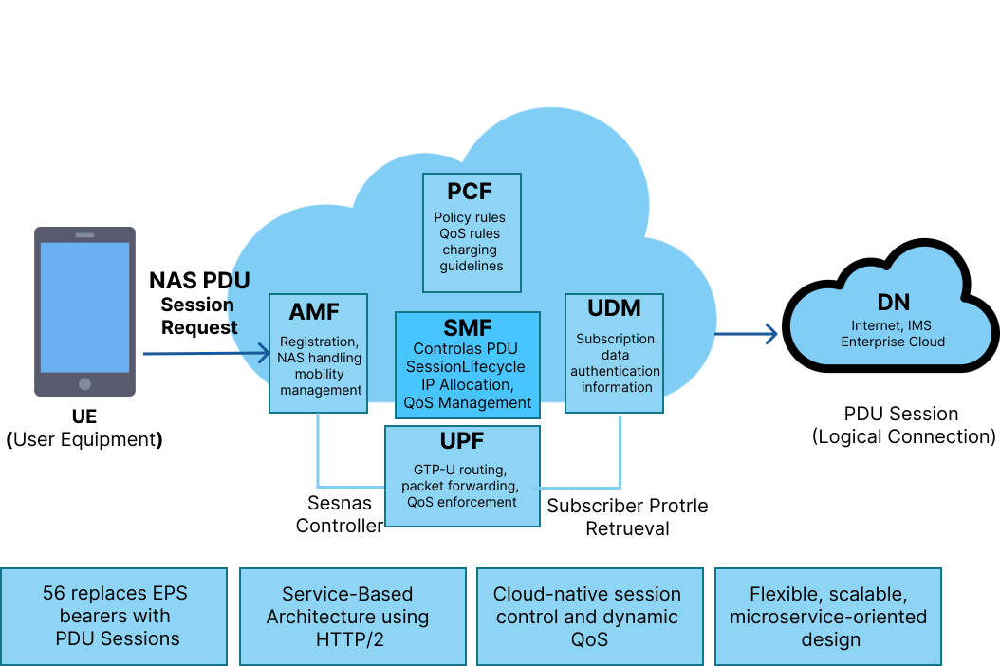
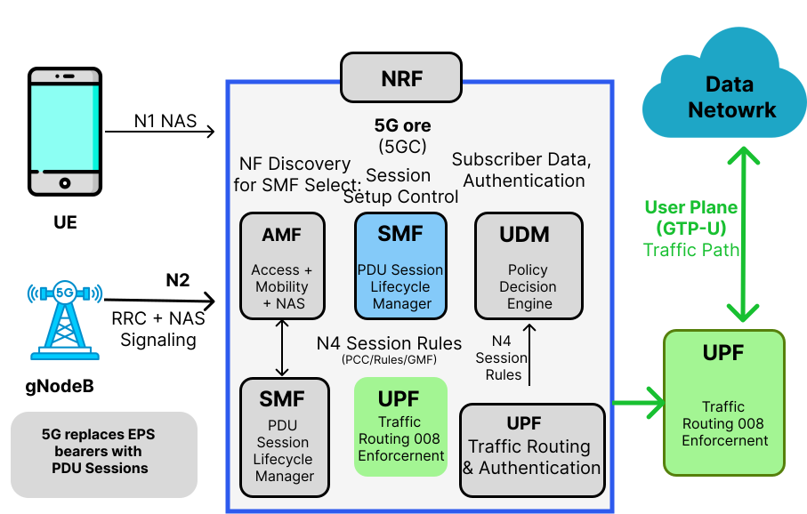
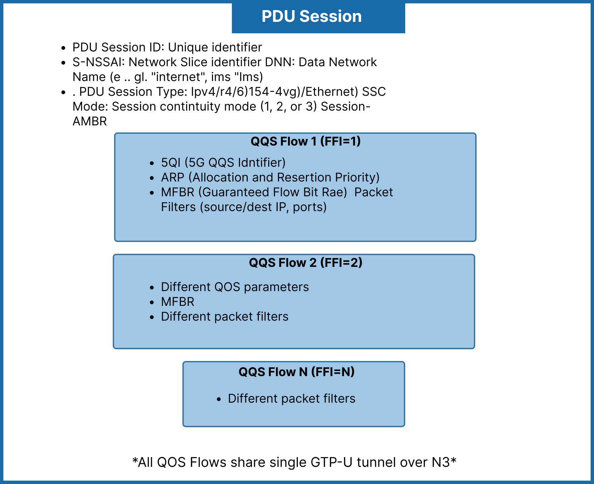
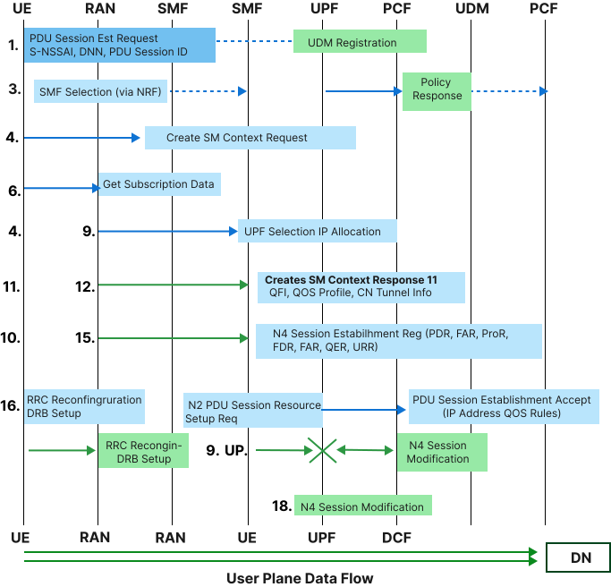
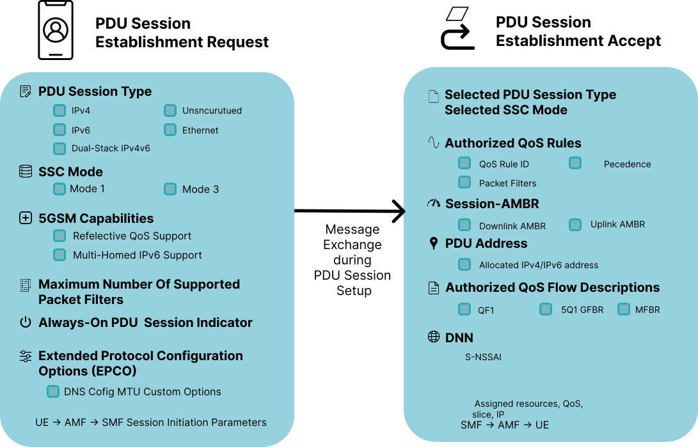
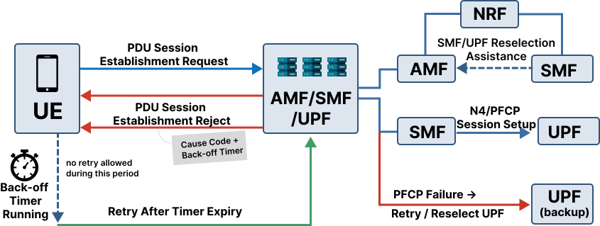

## 1.  5G Session Management

### 1.1 Introduction to Session Management in 5G

Session Management is a core functionality of the 5G Core (5GC) network that enables communication between the User Equipment (UE) and external Data Networks (DN) such as the internet, IMS, or enterprise services.

Unlike 4G LTE, where connectivity is managed through EPS bearers, 5G introduces a more flexible and scalable concept known as the **PDU (Protocol Data Unit) Session**. A PDU session represents a logical connection that allows the UE to send and receive data through the 5G network.

At the center of this architecture is the **Session Management Function (SMF)**, which acts as the control entity responsible for managing the entire lifecycle of a session.

### 1.2 Key Responsibilities of Session Management

- Establishing PDU sessions between UE and Data Network  
- Allocating IP addresses to the UE  
- Selecting appropriate User Plane Function (UPF)  
- Applying Quality of Service (QoS) policies  
- Managing session mobility and continuity  
- Handling session modification and release  

The 5G session management framework is built on the **Service-Based Architecture (SBA)**, where network functions communicate using **HTTP/2 REST APIs**, making the system highly scalable, modular, and cloud-native.

This design allows:

- Dynamic traffic routing  
- Low-latency communication  
- Efficient resource utilization  
- Seamless mobility support  

As illustrated in **Figure 1**, the high-level concept of session management within the 5G Core highlights the central role of the Session Management Function (SMF) in establishing connectivity between the User Equipment (UE) and external Data Networks via the Service-Based Architecture.

*Figure 1: Session management in 5G Core*

## 2. 5G Core Architecture for Session Management

Session management in 5G involves multiple network functions working together in a coordinated manner. **Figure 2** displays the 5G Core network architecture dedicated to session management, detailing the interconnected roles of key network functions such as the AMF, SMF, UPF, PCF, UDM, and NRF in coordinating data routing and policy enforcement.

### 2.1 Network Functions and Their Roles

#### 2.1.1 AMF (Access and Mobility Management Function)

- Acts as the entry point for UE signaling  
- Receives PDU session requests from UE  
- Performs UE authentication and mobility tracking  
- Forwards session requests to SMF  

#### 2.1.2 SMF (Session Management Function)

- Central controller for session management  
- Establishes, modifies, and releases PDU sessions  
- Allocates IP addresses to UE  
- Selects appropriate UPF  
- Retrieves policy rules from PCF  
- Configures user-plane tunnels  

#### 2.1.3 UPF (User Plane Function)

- Handles actual data traffic  
- Routes packets between UE and Data Network  
- Performs QoS enforcement  
- Collects usage data for charging  

#### 2.1.4 PCF (Policy Control Function)

- Provides QoS policies  
- Defines charging rules  
- Controls traffic steering  

#### 2.1.5 UDM (Unified Data Management)

- Stores subscriber information  
- Provides allowed DNNs and slice data  
- Supplies authentication data  

#### 2.1.6 NRF (Network Repository Function)

- Helps in discovering available network functions  
- Assists AMF in selecting appropriate SMF  

*Figure 2: 5G Core Architecture for Session Management*

## 3. PDU Session Concepts

A **PDU Session** is a logical connection between the UE and a Data Network. **Figure 3** outlines the structural components of a Protocol Data Unit (PDU) Session, depicting essential parameters such as the PDU Session ID, S-NSSAI, DNN, Session Type, SSC Mode, and QoS Flows that define the logical connection.

### 3.1 Key Parameters Explained

- **PDU Session ID**  
  A unique identifier assigned by the UE for each session.

- **S-NSSAI (Network Slice Identifier)**  
  Determines the network slice used for the session.

- **DNN (Data Network Name)**  
  Specifies the target network (e.g., internet, IMS).

- **PDU Session Type**  
  Defines the protocol:
  - IPv4  
  - IPv6  
  - IPv4v6  
  - Ethernet  
  - Unstructured  

- **SSC Mode (Session Continuity Mode)**  
  Defines how the session behaves during mobility:
  - SSC Mode 1 → Always same UPF  
  - SSC Mode 2 → UPF can change  
  - SSC Mode 3 → Session may be released  

- **QoS Flows**  
  Each session can contain multiple QoS flows with different priorities.

*Figure 3: PDU Session Structure*

## 4. PDU Session Establishment Process

The PDU Session Establishment is a multi-step signaling procedure. **Figure 4** visualizes this step-by-step signaling flow, tracing the interactions from the initial request by the UE through the AMF, SMF, and UPF, culminating in an active user plane data flow.

### 4.1 Step-by-Step Detailed Flow

Step 1. **UE → AMF**  
   UE sends **PDU Session Establishment Request** containing:
   - PDU Session ID  
   - S-NSSAI  
   - DNN  
   - Request type  

Step 2. **AMF Processing**

- Validates request  
- Checks subscription  
- Selects SMF via NRF  

Step 3. **AMF → SMF**

AMF sends **Create SM Context Request** including:

- SUPI  
- Session ID  
- Slice info  
- Location  

Step 4. **SMF → UDM**

- Retrieves subscription data  
- Gets allowed DNN and QoS  

Step 5. **SMF → PCF**

- Requests policy rules  
- Receives QoS and charging policies  

Step 6. **SMF Selects UPF**

- Based on location and load  
- Allocates IP address  

Step 7. **SMF → UPF (N4 PFCP)**

- Sends session rules:
  - PDR  
  - FAR  
  - QER  
  - URR  

Step 8. **UPF → SMF**

- Confirms session setup  

Step 9. **SMF → AMF**

- Sends session response  
- Includes QoS and tunnel info  

Step 10. **AMF → gNB**

- Sends N2 setup request  

Step 11. **gNB → UE**

- Establishes RRC and DRB  

Step 12. **UE Receives Accept**

- Gets IP address  
- Session becomes active  

Step 13. **User Plane Active**

Data flows:

UE → gNB → UPF → Data Network

*Figure 4: PDU Session Establishment Flow*

## 5. Session Management Messages

**Figure 5** summarizes the key session management messages, specifically contrasting the essential contents of the PDU Session Establishment Request sent by the UE with the subsequent PDU Session Establishment Accept returned by the network.

### 5.1 PDU Session Establishment Request

Contains:

- PDU type (IPv4/IPv6)  
- SSC mode  
- QoS capability  
- Request type  

### 5.2 PDU Session Establishment Accept

Contains:

- Assigned IP address  
- QoS rules  
- Session-AMBR  
- Selected slice  
- DNS configuration  

*Figure 5: Session Management Messages*

## 6. QoS Management in 5G

QoS in 5G is handled using **QoS Flows**.

### 6.1 Key Concepts

- **QFI (QoS Flow Identifier)**  
  Identifies each QoS flow  

- **5QI (5G QoS Identifier)**  
  Defines QoS characteristics such as:
  - Latency  
  - Priority  
  - Packet loss  

### 6.2 Reflective QoS

- UE derives QoS from downlink  
- Reduces signaling overhead  

### 6.3 Benefits

- Better traffic prioritization  
- Supports multiple services  
- Efficient bandwidth usage  

## 7. Session Modification and Release

### 7.1 Session Modification

Triggered when:

- QoS requirements change  
- New application demand  
- Policy update  
- Network optimization  

SMF updates:

- QoS rules  
- Traffic routing  
- Tunnel parameters  

### 7.2 Session Release

Triggered by:

- UE request  
- Network policy  
- Inactivity timeout  
- Radio failure  

After release:

- Resources are freed  
- Session context is removed  

## 8. Session Failure Scenarios and Retry Mechanisms
 
PDU sessions do not always establish, modify, or persist successfully. The 5G Core defines specific failure causes and retry behaviors so that transient issues are recovered gracefully without overwhelming the network with repeated requests.
 
### 8.1 Common Causes of Session Failure
 
- **Establishment failures**
  - SMF selection failure (no suitable SMF found via NRF)
  - DNN not allowed for the subscriber (UDM subscription check fails)
  - S-NSSAI not supported or not permitted in the current registration area
  - UPF selection failure (no UPF matches location/slice/DNN requirements)
  - IP address pool exhaustion
  - PCF policy rejection (e.g., quota exceeded, service not authorized)
  - N4 (PFCP) session establishment failure between SMF and UPF
  - Congestion control triggered by the network (overload at AMF, SMF, or UPF)
- **Modification failures**
  - QoS flow modification rejected due to insufficient resources
  - Policy update conflict from PCF
  - UPF unable to apply updated PDR/FAR/QER/URR rules
- **Mobility-related failures**
  - Handover failure causing session interruption
  - SSC Mode 3 session unable to establish a new PDU session before releasing the old one
  - Loss of N4 association between SMF and UPF during relocation
- **Abnormal release**
  - Radio link failure
  - AMF or SMF restart (loss of session context)
  - Inactivity timeout enforced by the network

### 8.2 Failure Signaling
 
When a PDU Session Establishment Request cannot be completed, the network returns a **PDU Session Establishment Reject** message to the UE containing:
 
- A **5GSM Cause Code** indicating the failure reason (e.g., "Insufficient resources," "Missing or unknown DNN," "Network slice not available")
- A **back-off timer**, when applicable, instructing the UE how long to wait before retrying
Similarly, modification attempts that fail return a **PDU Session Modification Reject**, and abnormal releases are signaled via a **PDU Session Release Command** with an associated cause code. **Figure 6** illustrates the signaling and decision processes involved when a session encounters a failure, detailing how reject messages convey cause codes and back-off timers to manage UE retry behaviors efficiently.
 

*Figure 6: Session Failure and Retry Flow*
 
### 8.3 Back-off Timers
 
Back-off timers prevent the UE from immediately re-attempting a request that is likely to fail again, protecting the network from signaling storms.
 
- **Session Management back-off timer**: applies to a specific PDU session/DNN/S-NSSAI combination; the UE must not request that same session again until the timer expires, unless higher-layer conditions (e.g., a new PDU session ID) apply.
- **Mobility Management back-off timer**: applies at a broader level and can restrict all SM signaling from the UE.
- Timer values are network-configured and delivered to the UE within the reject message.
### 8.4 UE Retry Behavior
 
- The UE stores the cause code and back-off timer per DNN/S-NSSAI.
- Retries are suppressed until the timer expires, except when triggered by:
  - A new PLMN (e.g., after mobility to a different network)
  - A change in UE capability or subscription
  - An explicit user- or application-triggered request
- After timer expiry, the UE may reattempt the PDU Session Establishment Request, optionally selecting a different DNN or requesting a different PDU session type if the prior cause suggests it.
### 8.5 Network-Side Retry and Recovery
 
- **SMF/UPF retry**: If N4 (PFCP) signaling fails, the SMF can retry session establishment with the same UPF a limited number of times before selecting an alternate UPF.
- **NRF-assisted reselection**: If SMF selection fails or the selected SMF is unreachable, AMF queries NRF again to select an alternate SMF.
- **Session context recovery**: If AMF or SMF restarts, standardized restart procedures (using NF heartbeat/status notifications via NRF) allow surviving network functions to detect the failure and either recover or gracefully release affected sessions.
- **Overload control**: When AMF, SMF, or UPF signal congestion, the network can throttle new session requests using load-based rejection with back-off timers rather than dropping requests silently.
### 8.6 Best Practices for Resilience
 
- Use **SSC Mode 2** or **Mode 3** where session continuity across UPF relocation is important, since Mode 1 sessions cannot survive a UPF change.
- Configure **redundant UPFs** per DNN/slice to allow fast reselection on failure.
- Apply **exponential back-off** at the application layer on top of the mandated 5GSM back-off timer to avoid synchronized retry storms across many UEs.
- Monitor **N4 session setup failures** and **SM cause code distributions** to detect systemic issues (e.g., IP pool exhaustion, policy misconfiguration) before they cause widespread session failures.